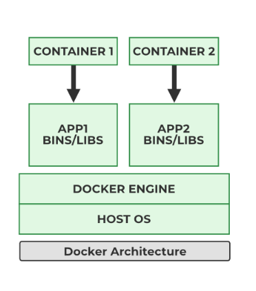

# Docker
Docker is an open-source containerization platform that allows developers to package applications along with their dependencies into lightweight, portable containers. These containers can run consistently across different environments such as development, testing, and production.

Docker is an OS‑level virtualization (or containerization) platform, which allows applications to share the host OS kernel instead of running a separate guest OS like in traditional virtualization.

Docker helps solve the problem of “it works on my machine” by ensuring application consistency and faster deployments.




## Monolithic vs Microservices
**Monolithic Architecture:**
In a monolithic architecture, the entire application is built as a single, tightly coupled unit.

**Characteristics:**

1.Single codebase

2.All components deployed together

3.One failure can affect the entire application

**Advantages:**

1.Simple to develop and deploy initially

2.Easy to test in small applications

**Disadvantages:**

1.Difficult to scale specific components

2.Hard to maintain as application grows

3.Slower deployments

**Microservices Architecture:**
In microservices architecture, the application is divided into small, independent services.

**Characteristics:**

1.Each service has its own codebase

2.Services communicate via APIs

3.Independent deployment and scaling

**Advantages:**

1.High scalability

2.Faster development and deployment

3.Fault isolation

**Disadvantages:**

1.Complex architecture

2.Requires monitoring and orchestration tools

## Traditional vs Virtualization vs Containerization

**Traditional Deployment**

Applications are installed directly on the operating system.

**-Limitations:**
Dependency conflicts
Poor resource utilization
Difficult scaling

**Virtualization**

Virtualization uses a hypervisor to run multiple virtual machines on a single physical server.

**-Features:**

Each VM has its own OS
Better isolation than traditional deployment
High resource consumption

**-Examples:**

VMware
VirtualBox

**Containerization**

Containerization runs applications in isolated containers sharing the host OS kernel.

**-Features:**

Lightweight
Fast startup
Efficient resource usage

**-Example:**

Docker


## What is Docker?

Docker is a containerization platform that enables developers to build, package, ship, and run applications inside containers.

**Key Components:**

**1.Docker Engine** – Core service to run containers

**2.Docker Image** – Read-only template for containers

**3.Docker Container** – Running instance of an image

**4.Docker Hub** – Public image registry

## Installation of Docker
**Step 1:** Launch an EC2 Instance.

**Step 2:** On Linux (Amazon Linux / Ubuntu)

**Use Commands:**

apt update -y

apt install docker -y

systemctl start docker

systemctl enable docker

## Docker Commands

```shell
docker run [ContainerImage]     # to run a container
docker run -d [ContainerImage]  # to run a container in detached mode
docker ps               # to list running containers
docker ps -a             # to list all containers
docker create [ContainerImage]  # to create a container
docker start [ContainerID]     # to start a container
docker stop [ContainerID]      # to stop a container
docker rm [ContainerID]        # to remove a container]
docker rm -f [ContainerID]     # to force remove a container
docker run -p [HostPort]:[ContainerPort] [ContainerImage]  # to expose a port
docker exec -it [ContainerID] bash  # to attach / access to a container
docker run -P [ContainerImage]  # to expose all ports on random ports from 32768 to 61000
docker logs [ContainerID]   # to check container logs
docker stats [ContainerID]  # to check container resources
docker images #to list downloaded docker images in system
docker image list # to list downloaded docker images in system
docker pull [imagename] #to download that image
docker image [subcommand] #to work with images
docker rm -f 'docker ps -aq' #to remove all the container
docker ps -a -q  #to list all the conatiner id
docker rmi [containerId] #to remove images
docker image inspect [imageId] #to see the detailed info of image
docker tag [imageId] [imageName:version] #to assign name and version to docker image
```

